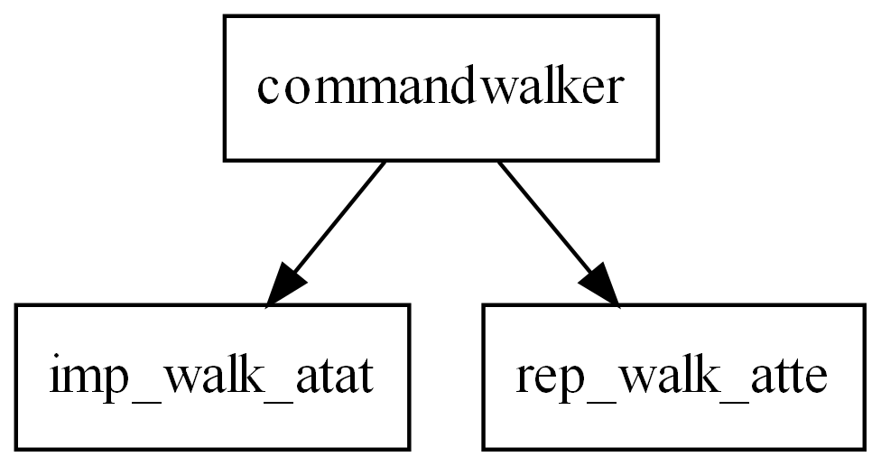
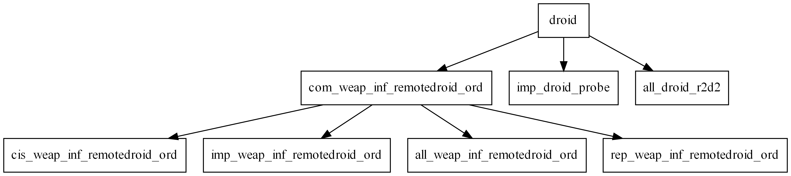

## SWBF2 Hierarchy
This is a tool to plot the hierarchy of all entity classes, defined in all given *.lvl files. 
 
Example: 

 
These small examples are chosen on purpose, since classes like "soldier" for example produce a far more nested hierarchy with lots of nodes.
 
## Build requirements
Make sure to clone with recurse submodules. Needs all dependencies of LibSWBF2 and an installation of the GraphViz C library.